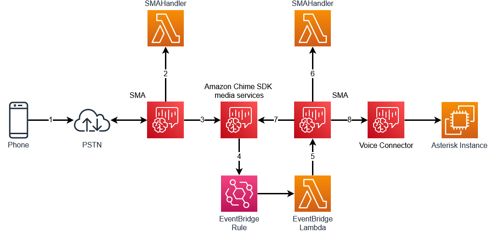
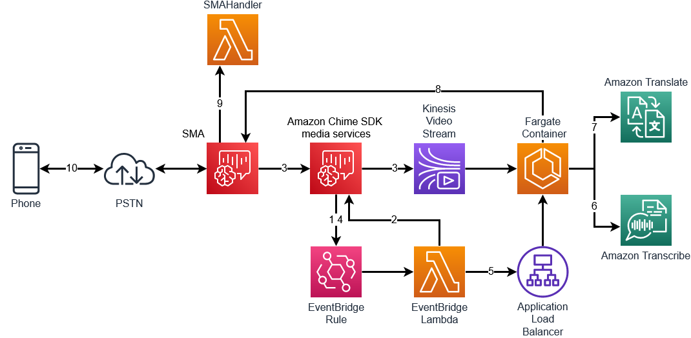

# Amazon Chime SDK Voice to Voice Translator

# Overview

This project leverages the Amazon Chime SDK to create a voice to voice live translator. It facilitates real time translation in voice calls enabling seamless communication between participants speaking different languages. The system integrates various AWS services, including Amazon Chime SDK, Amazon Kinesis Video Streams (KVS), Amazon Transcribe, Amazon Translate, Amazon Polly, etc. to achieve efficient and accurate translation.

# How it works

## Meeting Setup



The first step to creating the Amazon Chime SDK voice to voice translator is to join to participants together in an Amazon Chime SDK meeting. This is done in the following steps:

1. A call from the Public Switch Telephone Network (PSTN) is made to an Amazon Chime SDK SIP media application (SMA)
2. The SMAHandler AWS Lambda function is invoked with the [`NEW_INBOUND_CALL`](https://docs.aws.amazon.com/chime-sdk/latest/dg/case-1.html) event. This Lambda function uses the AWS SDK to create an Amazon Chime SDK meeting and attendee
3. This Lambda function returns an [action](https://docs.aws.amazon.com/chime-sdk/latest/dg/invoke-on-call-leg.html) to the SIP media application to [`JoinChimeMeeting`](https://docs.aws.amazon.com/chime-sdk/latest/dg/join-chime-meeting.html)
4. When the calling party joins the meeting, the EventBridge rule will trigger a `MeetingEventType.AttendeeJoined`
5. The EventBridge Lambda will
   1. Create a new attendee for this meeting
   2. Call [`CreateSipMediaApplicationCall`](https://docs.aws.amazon.com/chime-sdk/latest/APIReference/API_CreateSipMediaApplicationCall.html) to make a new `OUTBOUND_CALL` to the SIP media application using this meeting and attendee information
6. When the [`NEW_OUTBOUND_CALL`](https://docs.aws.amazon.com/chime-sdk/latest/dg/use-create-call-api.html) is received on the SMA, it will be joined to the Amazon Chime SDK meeting using the `X-chime-meeting-id` and `X-chime-join-token` information passed in the `CreateSipMediaApplicationCall`
7. When this call to join to the Amazon Chime SDK is successful, a `CALL_ANSWERED` event will invoke the SMA handler. The SMA handler will return a [`CALL_AND_BRIDGE`](https://docs.aws.amazon.com/chime-sdk/latest/dg/call-and-bridge.html) action to create a call to the Asterisk PBX

Once completed, we will have two participants joined together in an Amazon Chime SDK meeting. If they both speak the same language, they'll be able to communicate with each other. However, if we need to translate their speech, we will need to stream their audio to something that can transcribe and translate it.

## Call Legs

One important concept to keep in mind when using this demo are the different [`Call Legs`](https://docs.aws.amazon.com/chime-sdk/latest/dg/call-architecture.html). In this demo, there are two separate calls, each with their own call legs.

### Inbound Call from PSTN

For the inbound call from the PSTN, the call legs will be:

- Call from PSTN to SMA: `LEG-A`
- Call from SMA to Amazon Chime SDK meeting: `LEG-B`

### Outbound Call to PBX

For the outbound call to the Asterisk PBX, the call legs will be:

- Call from SMA to Amazon Chime SDK meeting: `LEG-A`
- CallAndBridge from SMA to Voice Connector: `LEG-B`

This will be important when determining where to play audio and an important piece of information to keep track of.

## Meeting Audio Processing

Once the meeting has been established and attendees joined, the processing of the audio can begin. This is where the audio will be transcribed, translated, and played back to the attendees.



1. When the meeting is started, the [EventBridge rule](https://docs.aws.amazon.com/eventbridge/latest/userguide/eb-rules.html) is triggered for `MeetingEventType.MeetingStarted`
2. The EventBridge Lambda will execute a `CreateMediaStreamPipeline` to begin streaming to KVS
3. Steaming from the Amazon Chime SDK meeting will begin towards the Amazon Kinesis Video Stream
4. When streaming has started, the EventBridge rule will trigger again with `MediaStreamPipelineEventType.MediaPipelineKinesisVideoStreamStart`
5. The EventBridge lambda will instruct the Fargate container to begin consuming the KVS stream
6. The KVS consumer will stream the audio from KVS to Amazon Transcribe
7. When a non-partial event is received from Amazon Transcribe, the result will be sent to Amazon Translate to be translated from the source language to the destination language
8. The response from Amazon Translate will be sent to the SMA via [`UpdateSipMediaApplicationCall`](https://docs.aws.amazon.com/chime-sdk/latest/APIReference/API_voice-chime_UpdateSipMediaApplicationCall.html)
9. Wen the [`CALL_UPDATE_REQUESTED`](https://docs.aws.amazon.com/chime-sdk/latest/dg/update-sip-call.html) event is received, a `[SPEAK]`(https://docs.aws.amazon.com/chime-sdk/latest/dg/speak.html) action is returned to play the translated audio to the attendee using Amazon Polly

This process occurs in both directions for both participants. Each participant's audio will be streamed via KVS to the consumer and transcribed. The result in this demo, is the PSTN caller will hear the translated audio from the Asterisk PBX and their audio will be transcribed and translated and sent to the Asterisk PBX.

## Preventing `Speak` action interruptions

Every time a non-partial Amazon Transcribe event arrives on the audio consumer, a new `UpdateSipMediaApplicationCall` request is made that will return a `Speak` action to the SIP media application. However, if a second `UpdateSipMediaApplicationCall` request is made before the first `Speak` action has completed, it will interrupt the first `Speak` action and begin playing the second `Speak` action audio.

To prevent this audio from being interrupted, this demo keeps track of the `Speak` actions being played in the Transaction Attributes.

### No existing response being played

If no existing response is being played, the `Speak` action information is stringified and stored in the Transaction Attributes.

```typescript
export function handleNewResponse(
  event: SipMediaApplicationEvent,
  transactionAttributes: TranslatorTransactionAttributes,
  callLeg: string,
  actions: Actions[],
) {
  console.log(
    'No existing Response being played. Playing the Request and storing information in TransactionAttributes',
  );
  transactionAttributes.CallResponse = JSON.stringify([
    createCallResponse(event),
  ]);
  actions.push(
    speakAction(
      event.ActionData!.Parameters.Arguments.Text,
      event.ActionData!.Parameters.Arguments.Language as PollyLanguageCodes,
      callLeg,
    ),
  );
  return { transactionAttributes, actions };
}

function createCallResponse(event: SipMediaApplicationEvent): CallResponse {
  return {
    AttendeeType: event.ActionData!.Parameters.Arguments.AttendeeType,
    Language: event.ActionData!.Parameters.Arguments.Language,
    Text: event.ActionData!.Parameters.Arguments.Text,
  };
}
```

### Existing response being played

If an existing action is being played, instead of starting a new `Speak` action, we want to append the new `Speak` action to the Transaction Attribute and return an empty action. This will store the `Speak` action for the future and not interrupt the currently playing audio.

```typescript
export function handleExistingResponse(
  event: SipMediaApplicationEvent,
  transactionAttributes: TranslatorTransactionAttributes,
  existingCallResponse: CallResponse[],
  callLeg: string,
  actions: Actions[],
) {
  console.log(
    'Found an existing Response being played. Caching the new request in TransactionAttributes',
  );
  existingCallResponse.push(createCallResponse(event));
  transactionAttributes.CallResponse = JSON.stringify(existingCallResponse);
  return { transactionAttributes, actions };
}
```

### Determining if a previous action is being played

To know if a previous action is being played, this demo uses the `ACTION_SUCCESSFUL` invocation to track the Transaction Attributes. When an `ACTION_SUCCESSFUL` event arrives for a `Speak` action, the Transaction Attributes will be processed.

```typescript
export async function speakSuccessfulHandler(
  event: SipMediaApplicationEvent,
  transactionAttributes: TranslatorTransactionAttributes,
) {
  let actions: Actions[] = [];
  ({ transactionAttributes } = setCallId(event, transactionAttributes));
  const callLeg = determineCallLeg(transactionAttributes);
  ({ transactionAttributes, actions } = processCallResponse(
    transactionAttributes,
    actions,
    callLeg,
  ));

  return { actions, transactionAttributes };
}
```

This function will check for one of three possible `CallResponse` Transaction Attributes:

- 0 objects in the `CallResponse` array - do nothing
- 1 object in the `CallResponse` array - remove the object and return no new actions
- \>1 objects in the `CallResponse` array - remove the first object and return an action to `Speak` the second object

```typescript
export function processCallResponse(
  transactionAttributes: TranslatorTransactionAttributes,
  actions: Actions[],
  callLeg: string,
) {
  if (transactionAttributes.CallResponse) {
    let existingCallResponse: CallResponse[] = JSON.parse(
      transactionAttributes.CallResponse,
    ) as CallResponse[];
    if ((existingCallResponse.length = 0)) {
      console.log('No existingCallResponse found.');
    } else if ((existingCallResponse.length = 1)) {
      console.log(
        '1 existingCallResponse found.  Removing first object in list',
      );
      existingCallResponse.shift();
      transactionAttributes.CallResponse = JSON.stringify(existingCallResponse);
    } else if (existingCallResponse.length > 1) {
      console.log(
        '>1 existingCallResponse found.  Removing first object in list and playing second object.',
      );
      transactionAttributes.CallResponse = JSON.stringify(existingCallResponse);
      actions = [
        speakAction(
          existingCallResponse[1].Text,
          existingCallResponse[1].Language as PollyLanguageCodes,
          callLeg,
        ),
      ];
      existingCallResponse.shift();
    }
  }
  return { transactionAttributes, actions };
}
```

Now, if a new `UpdateSipMediaApplicationCall` request is made while the SIP media application is currently playing a previous request, instead of interrupting the audio, the SMA handler will cache the message and play it the next time an `ACTION_SUCCESSFUL` event for a `Speak` action is received.

# SETTING UP RESOURCES NEEDED TO RUN KVS CONSUMER ON ECS

The “kvsconsumerrole” IAM role is created and assigned policies. It also includes the managed policy for basic Lambda execution. This role will be assumed by the ECS task.
The policies grant permissions to

- Invoke Bedrock model via the `bedrock:InvokeModel` action
- Update calls in the Chime SIP media application via `chime:UpdateSipMediaApplicationCall`
- Access kinesis video streams via `kinesisvideo:GetDataEndpoint` and `kinesisvideo:GetMedia`
- Start transcribe transcription jobs via `transcribe:StartStreamTranscription`
- Use the translate text translation service via `translate:TranslateText`
- Access items in the dynamodb meeting table via the actions on the table ARN
- All these ensure that the ECS tasks running the container have authorization to make necessary API calls.

The ECSResources class creates the resources required to run the KVS consumer application on an ECS Fargate service.
An application load balancer is created within the VPC subnets
An ApplicationLoadBalancedFargateService is instantiated, passing in details of the task image, IAM role, environment variables, VPC networking details and Auto scaling parameters. Auto scaling is configured to scale between 1-10 tasks based on a CloudWatch metric.
All the necessary components are set up to run the KVS consumer container in a scalable, load balanced manner on Fargate.

# KVS Consumer breakdown

The KVS consumer starts by reading MKV (Matroska Video) data from the KVS stream. MKV is a multimedia container format that can include audio, video, and subtitles. In this context, the MKV data primarily contains audio information from the Amazon Chime SDK meeting.

# Conversion of Audio Format using ffmpeg

This audio data, originally in the AAC (Advanced Audio Coding) format, is not directly compatible with Amazon Transcribe. Therefore, it needs to be converted into a format that Transcribe can process.
To perform this conversion, the stream is passed through `ffmpeg`, a multimedia framework, it is capable of transcoding, muxing, demuxing, streaming, and playing various media formats.
In this process, `ffmpeg` converts the audio from the AAC format to OPUS. OPUS is an audio coding format known for its efficiency in voice communication applications, suited for real-time applications mostly because of its low latency and adaptability of different bandwidths.
Once the audio is converted to OPUS format, this stream is then sent to Amazon Transcribe. By doing this, the system is essentially turning spoken words from the Chime SDK meeting into text.
Transcribe event will be received and sent to Amazon Bedrock

# MEDIA STREAM PIPELINE

An Amazon Kinesis Video Streams (KVS) has to be created to use the Amazon Chime SDK media stream pipelines. It is created during deployment of the CDK using `cdk-amazon-chime-resources`. The pool will be needed when `CreateMediaStreamPipeline` is called.

```typescript
this.kinesisVideoStreamPool = new KinesisVideoStreamPool(
  this,
  'kinesisVideoPoolStream',
  {
    streamConfiguration: {
      dataRetentionInHours: 1,
      region: 'us-east-1',
    },
  },
);
```

Media stream pipelines in Amazon Chime capture individual audio for each attendee in a meeting, as well as mixed audio. These audio streams are streamed to Amazon Kinesis Video Streams (KVS)

```typescript
const eventBridgeRole = new Role(this, 'eventBridgeRole', {
      assumedBy: new ServicePrincipal('lambda.amazonaws.com'),
      inlinePolicies: {
        ['chimePolicy']: new PolicyDocument({
          statements: [
            new PolicyStatement({
              resources: ['*'],
              actions: [
                'chime:CreateMediaStreamPipeline',
                'chime:CreateSipMediaApplicationCall',
                'chime:CreateAttendee',
              ],
            }),
          ],
        }),
      },
```

## Testing It Out

To see this demo in action, once deployed, the CDK output will include multiple phone numbers:

```bash
AmazonChimeSDKVoiceVoiceTranslator.frenchPhoneNumber = +16185551111
AmazonChimeSDKVoiceVoiceTranslator.germanPhoneNumber = +16185552222
AmazonChimeSDKVoiceVoiceTranslator.hindiPhoneNumber = +16185553333
AmazonChimeSDKVoiceVoiceTranslator.portuguesePhoneNumber = +16185555555
AmazonChimeSDKVoiceVoiceTranslator.spanishPhoneNumber = +16185556666
```

Calling these language numbers will result in a call delivered to the Asterisk PBX that will play a recording in the associated language. Once the playback starts, you should hear the call start to be translated into English.

# Deploy

To deploy this demo:

- Docker desktop running
- ARM processor on build/deploy instance
- AWS account

## Create Service Linked Role

This demo requires a [service-linked role](https://docs.aws.amazon.com/chime-sdk/latest/ag/using-service-linked-roles-media-pipeline.html) enabled for Amazon Chime SDK media pipelines. If this is not already created for your account, you will need to create it:

```bash
aws iam create-service-linked-role --aws-service-name mediapipelines.chime.amazonaws.com
```

## CDK Deployment

```bash
yarn launch
```

# Cleanup

To clean up any created resources:

```bash
yarn cdk destroy
```
